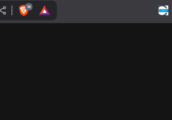
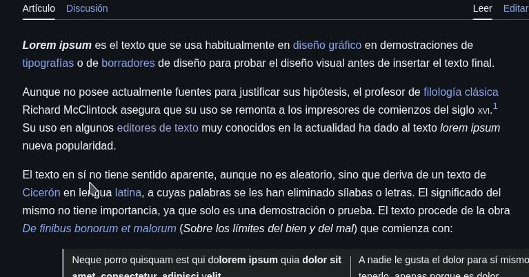

# FocusRead - Speed Reading Extension

  

**[English](#english) | [Español](#español)**

---

## 🇬🇧 English

FocusRead is a browser extension designed to enhance your online reading experience. It uses the rapid serial visual presentation (RSVP) technique to help you read faster by highlighting words one by one, minimizing eye movement and keeping you focused.

### ✨ Features

*   **Word-by-Word Highlighting**: Activates a focused reading mode on any selected text.
*   **Adjustable Speed**: Control the reading pace (Words Per Minute) from a clean popup menu.
*   **Smart Contrast**: Automatically switches between a light (yellow) and dark (blue) theme for the highlighter based on the website's background color.
*   **Intuitive Controls**:
    *   Start reading from the right-click context menu.
    *   Click anywhere on the page to **Pause** or **Resume**.
    *   The reading automatically stops when the text ends.

### 🚀 Installation

#### From the Chrome Web Store (Coming Soon!)

(Link will be available once the extension is published)

#### From Source (For Developers)

1.  Download or clone this repository to your local machine.
2.  Open Google Chrome and navigate to `chrome://extensions`.
3.  Enable **"Developer mode"** using the toggle in the top-right corner.
4.  Click on the **"Load unpacked"** button.
5.  Select the `focus-read` project folder. The extension is now installed!

### 📖 How to Use

1.  **Set your speed**: Click the FocusRead icon in your browser's toolbar to open the popup and adjust the PPM slider to your desired speed.
2.  **Select text**: On any webpage, highlight the text you want to read.
3.  **Start reading**: Right-click on the selected text and choose **"Start reading with FocusRead"**.
4.  **Pause/Resume**: Simply click anywhere on the page to pause the reader. Click again to resume.

### ❤️ Support the Project

FocusRead is a free and open-source project developed with love. If you find this tool helpful and want to support its future development, please consider making a small donation. Your support helps cover development time and allows me to add new features!

 

### 📄 License

This project is licensed under the **MIT License**. See the `LICENSE` file for more details.

---

## 🇪🇸 Español

FocusRead es una extensión para navegadores diseñada para mejorar tu experiencia de lectura online. Utiliza la técnica de presentación visual rápida en serie (PVRS) para ayudarte a leer más rápido, resaltando las palabras una por una para minimizar el movimiento ocular y mantener tu concentración.

### ✨ Características

*   **Resaltado Palabra por Palabra**: Activa un modo de lectura enfocada en cualquier texto que selecciones.
*   **Velocidad Ajustable**: Controla el ritmo de lectura (Palabras Por Minuto) desde un sencillo menú emergente.
*   **Contraste Inteligente**: Cambia automáticamente entre un tema claro (amarillo) y oscuro (azul) para el resaltador, basándose en el color de fondo del sitio web.
*   **Controles Intuitivos**:
    *   Inicia la lectura desde el menú contextual (clic derecho).
    *   Haz clic en cualquier parte de la página para **Pausar** o **Reanudar**.
    *   La lectura se detiene automáticamente al finalizar el texto.

### 🚀 Instalación

#### Desde la Chrome Web Store (¡Próximamente!)

(El enlace estará disponible cuando la extensión sea publicada)

#### Desde el Código Fuente (Para Desarrolladores)

1.  Descarga o clona este repositorio en tu máquina local.
2.  Abre Google Chrome y navega a la dirección `chrome://extensions`.
3.  Activa el **"Modo de desarrollador"** con el interruptor en la esquina superior derecha.
4.  Haz clic en el botón **"Cargar descomprimida"**.
5.  Selecciona la carpeta del proyecto `focus-read`. ¡La extensión ya está instalada!

### 📖 Cómo Usar la Extensión

1.  **Ajusta tu velocidad**: Haz clic en el icono de FocusRead en la barra de herramientas para abrir el menú y ajusta el deslizador de PPM a tu velocidad deseada.
2.  **Selecciona el texto**: En cualquier página web, selecciona el texto que quieras leer.
3.  **Inicia la lectura**: Haz clic derecho sobre el texto seleccionado y elige **"Iniciar lectura con FocusRead"**.
4.  **Pausa/Reanuda**: Simplemente haz clic en cualquier lugar de la página para pausar la lectura. Vuelve a hacer clic para reanudarla.

### ❤️ Apoya el Proyecto

FocusRead es un proyecto de código abierto y gratuito desarrollado con mucho cariño. Si esta herramienta te resulta útil y quieres apoyar su desarrollo futuro, por favor, considera hacer una pequeña donación. ¡Tu apoyo ayuda a cubrir el tiempo de desarrollo y me permite añadir nuevas funcionalidades!

### 📄 Licencia

Este proyecto está bajo la **Licencia MIT**. Consulta el archivo `LICENSE` para más detalles.